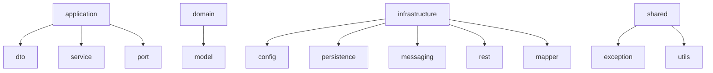

# 🍽️ Cardápio Digital

Projeto de **Cardápio Digital** desenvolvido em **Java 17** e **Spring Boot**, seguindo o padrão de **Clean Architecture**.  
O objetivo é permitir que **donos de restaurante** possam criar e gerenciar seus cardápios de forma digital, enquanto **clientes** podem consultar os cardápios sem a necessidade de autenticação.  

---

## 🚀 Tecnologias Utilizadas

- **Java 17**
- **Spring Boot** (REST API, injeção de dependência, etc.)
- **Spring Security + JWT** (autenticação e autorização)
- **Spring Data JPA / Hibernate** (persistência de dados)
- **H2/PostgreSQL** (banco de dados em memória para dev e relacional para produção)
- **MapStruct** (conversão entre entidades e DTOs)
- **Swagger / OpenAPI** (documentação da API)
- **JUnit 5 + Mockito + RestAssured** (testes unitários e de integração)

---

## 🏛️ Arquitetura

A arquitetura segue os princípios de **Clean Architecture**, separando regras de negócio de implementações técnicas.  
Isso facilita testes, manutenção e evolução do projeto.
`
src/main/java/com/comandaDigital
│
├── application → Casos de uso (regras orquestradas do sistema)
│ ├── dto → Objetos de entrada/saída dos casos de uso
│ ├── service → Implementação dos casos de uso
│ └── port → Interfaces (input/output) usadas pelos casos de uso
│
├── domain → Entidades e regras de negócio puras
│ └── model → Entidades do domínio (sem dependência de Spring)
│
├── infrastructure → Implementações técnicas (adapters)
│ ├── config → Configurações do Spring (Beans, MQ, Security etc.)
│ ├── persistence → Repositórios (JPA, JDBC, etc.)
│ ├── messaging → MQ/Kafka/RabbitMQ (futuro)
│ ├── rest → Controllers REST
│ └── mapper → MapStruct/ conversores
│
└── shared → Utilitários e classes comuns
├── exception → Exceções customizadas
└── utils → Helpers

`

---

### 🖼️ Visão em diagrama (Mermaid)
> O GitHub já renderiza automaticamente 🎉

# 🗄️ Banco de Dados - Cardápio Digital

Este documento descreve o **modelo de banco de dados** utilizado no projeto **Cardápio Digital**.  
O banco é **PostgreSQL** e foi projetado para armazenar informações de usuários, comércios, cardápios e produtos, permitindo que clientes consultem cardápios online.

## 🏛️ Estrutura de Tabelas

### 1. Usuário (`usuario`)
Tabela que armazena os dados dos donos de comércio que podem criar cardápios.

| Coluna         | Tipo           | Observações                           |
|----------------|----------------|---------------------------------------|
| id             | SERIAL         | PK, identificador do usuário          |
| nome           | VARCHAR(100)   | Nome completo                          |
| email          | VARCHAR(100)   | Único, usado para login               |
| senha          | VARCHAR(255)   | Senha hash                            |
| telefone       | VARCHAR(20)    | Opcional                              |
| status         | VARCHAR(20)    | Ex: ATIVO / INATIVO                   |
| data_criacao   | TIMESTAMP      | Data de criação do usuário            |

---

### 2. Tipo de Comércio (`tipo_comercio`)
Tabela que define os tipos de comércio para classificação e filtro.

| Coluna | Tipo         | Observações                    |
|--------|--------------|--------------------------------|
| id     | SERIAL       | PK                             |
| nome   | VARCHAR(50)  | Único, ex: Restaurante, Padaria |

---

### 3. Comércio (`comercio`)
Tabela que representa o restaurante ou estabelecimento vinculado a um usuário.

| Coluna        | Tipo           | Observações                          |
|---------------|----------------|--------------------------------------|
| id            | SERIAL         | PK                                   |
| usuario_id    | INT            | FK → `usuario(id)`                   |
| nome          | VARCHAR(100)   | Nome do comércio                     |
| tipo_id       | INT            | FK → `tipo_comercio(id)`             |
| instagram     | VARCHAR(150)   | Link opcional                        |
| facebook      | VARCHAR(150)   | Link opcional                        |
| whatsapp      | VARCHAR(50)    | Contato opcional                      |
| data_criacao  | TIMESTAMP      | Data de criação do comércio          |

---

### 4. Cardápio (`cardapio`)
Tabela que armazena cardápios de um comércio. Um comércio pode ter vários cardápios.

| Coluna       | Tipo          | Observações                       |
|--------------|---------------|----------------------------------|
| id           | SERIAL        | PK                               |
| comercio_id  | INT           | FK → `comercio(id)`              |
| nome         | VARCHAR(100)  | Nome do cardápio (ex: Almoço)    |
| data_criacao | TIMESTAMP     | Data de criação                  |

---

### 5. Produto (`produto`)
Itens do cardápio. Cada cardápio pode ter vários produtos.

| Coluna       | Tipo          | Observações                       |
|--------------|---------------|----------------------------------|
| id           | SERIAL        | PK                               |
| cardapio_id  | INT           | FK → `cardapio(id)`              |
| nome         | VARCHAR(100)  | Nome do produto                  |
| descricao    | TEXT          | Descrição opcional               |
| preco        | NUMERIC(10,2) | Preço do produto                 |
| status       | VARCHAR(20)   | Ex: ATIVO / INATIVO              |
| data_criacao | TIMESTAMP     | Data de criação                  |

---

## 🔗 Relacionamentos

- **Usuário → Comércio** : 1:N  
- **Comércio → Cardápio** : 1:N  
- **Cardápio → Produto** : 1:N  
- **Comércio → Tipo de Comércio** : N:1  

---

## 💡 Observações

1. As senhas de usuário devem ser armazenadas como **sha-512**.  
2. Links de redes sociais são opcionais, mas podem ser usados na página pública do cardápio.  
3. O modelo atual não possui ingredientes detalhados (MVP), mas pode ser expandido futuramente.  
4. O campo `status` em usuário e produto permite controlar visibilidade sem excluir registros.  
5. Todos os `id`s são **SERIAL**, auto incrementáveis.  
  

## variaveis de conexao com a base de dados logal
# Conexão com o banco PostgreSQL
spring.datasource.url=jdbc:postgresql://localhost:5432/cardapio_db
spring.datasource.username=cardapio_user
spring.datasource.password=cardapio_pass
spring.datasource.driver-class-name=org.postgresql.Driver

# JPA/Hibernate
spring.jpa.hibernate.ddl-auto=update
spring.jpa.show-sql=true
spring.jpa.properties.hibernate.format_sql=true
spring.jpa.properties.hibernate.dialect=org.hibernate.dialect.PostgreSQLDialect
